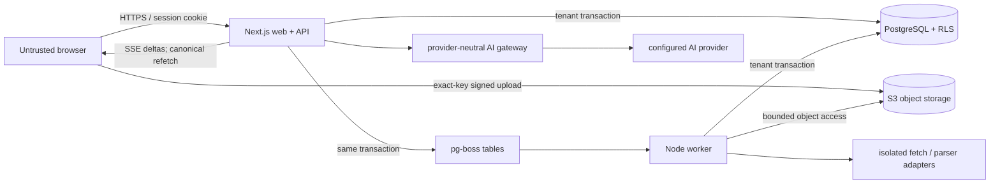

# Architecture

## Outcome

Siftloom starts as a **modular monolith with two processes**: a Next.js web/API process
and a durable worker. They share TypeScript domain packages and PostgreSQL, while large
binaries live behind a project-owned S3 interface. This minimizes distributed-system
surface area without putting long-running or retryable work inside HTTP requests.



## M0 implementation status

This document describes the approved target architecture. Acceptance of an ADR is not a
claim that its product path is already implemented.

| Area                 | Present in M0                                                                                          | Planned milestone                                                           |
| -------------------- | ------------------------------------------------------------------------------------------------------ | --------------------------------------------------------------------------- |
| Web/worker workspace | Runnable Next.js shell, health route, worker boot and pg-boss schema bootstrap                         | Product routes and job handlers in M1–M4                                    |
| Tenant data boundary | Core graph schema, composite FKs, runtime roles, RLS transaction helper, real two-tenant database test | Session-bound repositories and complete resource matrix in M1               |
| Canvas               | Project-owned React Flow adapter and deterministic 200/300 dynamic benchmark                           | Persistent editing/autosave in M2                                           |
| Storage/ingestion    | Interfaces, central limits, URL request-shape validation, local S3Mock                                 | Signed S3 adapter and isolated ingestion pipeline in M3                     |
| AI                   | Provider-neutral contract and deterministic fake                                                       | Context manifests, live evaluated adapter, SSE and usage finalization in M4 |
| Authentication       | Better Auth decision and threat controls only                                                          | Actual database sessions, Google OIDC and magic link in M1                  |

## Repository topology

| Path                 | Responsibility                                                                                 | Forbidden dependencies                                                      |
| -------------------- | ---------------------------------------------------------------------------------------------- | --------------------------------------------------------------------------- |
| `apps/web`           | Server-rendered product shell, route handlers, session/auth boundary, SSE, browser composition | Provider secrets in client components; long extraction; direct unscoped SQL |
| `apps/worker`        | Leased ingestion and maintenance jobs, retry classification, stale-worker guards               | Trusting queue payload ownership; rendering/UI logic                        |
| `packages/shared`    | Provider/library-neutral IDs, canvas/domain types, limits, deterministic fixtures              | React Flow, database driver, provider SDKs                                  |
| `packages/ui`        | Design system and the only React Flow adapter boundary                                         | Persistence records, provider SDKs, tenant authorization                    |
| `packages/db`        | Drizzle schema/migrations, tenant transactions, scoped repositories, RLS support               | HTTP/session parsing; React/client code                                     |
| `packages/ingestion` | Object storage, fetch, parser, normalization contracts and deterministic fakes                 | Browser execution; ambient cloud credentials inside parsers                 |
| `packages/ai`        | Context manifest contract, provider gateway, deterministic fake, usage normalization           | Canvas-library types; unapproved board queries; client-side provider keys   |

Dependencies point inward: apps may compose packages; infrastructure adapters implement
domain contracts; domain types do not import UI, persistence, or provider SDKs.

## Runtime topology

### Web request

1. Validate the authenticated Better Auth session server-side.
2. Resolve active membership from server-owned user identity; a client workspace ID is
   only a requested scope.
3. Parse runtime input with Zod and create a workspace-scoped database transaction.
4. `SET LOCAL app.workspace_id` and `app.user_id`; RLS provides defense in depth.
5. Run a repository method that requires `WorkspaceScope`, check parent/child scope, and
   return a non-disclosing not-found result for mismatches.
6. Commit canonical state before acknowledging the client.

### Durable job submission

1. Authorize and validate the logical ingestion command.
2. In one PostgreSQL transaction, create the asset/job intent and enqueue pg-boss work
   using its transaction adapter.
3. Return the canonical logical job ID; queue delivery is not the product record.
4. The worker claims a lease, opens a fresh tenant-scoped transaction, verifies the
   parent chain, and creates an immutable attempt.
5. Every external effect uses an idempotency key. A stale lease or cancellation cannot
   overwrite a newer terminal outcome.

The pg-boss row is the transactional dispatch mechanism for internal jobs. A separate
outbox table is added only when Siftloom must publish events to an external broker or
webhook destination.

### AI run and stream

1. Authorize chat, board, membership, and every explicitly selected/connected source.
2. Freeze immutable snapshots and a context manifest before contacting a provider.
3. Reserve quota and persist one provider attempt with a stable logical run ID.
4. Stream non-canonical deltas through SSE. Events have run ID and sequence number and
   may be duplicated, delayed, or missed.
5. Finalize assistant message, validated source handles, and append-only usage once in a
   database transaction; the client canonically refetches.
6. If the provider outcome is ambiguous, move to `reconciliation_required`. Never
   automatically reinvoke a paid request whose outcome might already exist.

WebSockets are deferred until multiplayer or incremental-input requirements justify a
persistent bidirectional channel.

## Persistence model

PostgreSQL is canonical for users, workspaces, memberships, boards, graph state, assets,
jobs, attempts, context manifests, messages, mutation receipts, and usage events. S3 is
canonical only for authorized binary/large derived objects whose ownership and expected
metadata are recorded in PostgreSQL.

Every practical tenant-owned table carries `workspace_id`. Composite foreign keys ensure
that board, node, edge, asset, chat, and attempt parents share the same workspace. Global
UUIDs reduce guessing but are not authorization. Better Auth identity tables remain
global; domain membership performs authorization.

Migrations use this one-way authority:

```text
Drizzle TypeScript schema
  -> drizzle-kit generate
  -> checked-in SQL review (including RLS/policies)
  -> drizzle-kit migrate
```

`drizzle-kit push` is not permitted in shared or production environments.

## Canvas state and autosave

The browser separates:

- normalized geometry and selection;
- versioned node content;
- upload/ingestion progress;
- streaming run state;
- acknowledged server revision and pending mutation queue.

Only `packages/ui` maps domain `CanvasNode`/`CanvasEdge` to React Flow types. Stable
custom node types and fine-grained selectors prevent an ingestion or chat stream from
rerendering unaffected nodes.

Autosave sends a bounded ordered operation batch after 750 ms. The board revision orders
canonical snapshots; per-record revisions decide true conflicts. Mutation receipts make
acknowledged retries idempotent. A failed/conflicted save retains local operations and
keeps the UI visibly dirty.

## Local and production infrastructure

Local Compose runs PostgreSQL 17.9 and Adobe S3Mock 5.1.0. S3Mock is only a fast API
double: it does not prove presigned URL signature/expiry/method enforcement. Before an
external alpha, an opt-in contract suite must run against a real S3 bucket with CORS,
checksum, multipart, expiry, and method-negative tests.

The production baseline is Dockerized Next.js and worker services on AWS ECS/Fargate in
`ap-southeast-1`, RDS PostgreSQL, private S3 buckets, an ALB configured for streaming,
and separate migration/web/worker database roles. The code remains portable to another
container, PostgreSQL, and S3 provider.

## Observability

Structured events contain opaque IDs, scope IDs, operation type, attempts, durations,
bytes, token counts, queue age, and normalized error codes. They exclude source text,
prompts, responses, raw URLs, filenames when sensitive, session tokens, authorization
headers, and signed URLs.

Initial alerts cover suspected tenant leakage, save-failure rate, queue age/stuck leases,
ingestion terminal failures, AI reconciliation backlog, duplicate usage constraints, and
unusual quota spend.

## Verification strategy

- M0 unit evidence: domain limits, fixture determinism and provider/ingestion fakes.
- M0 integration evidence: repeatable real PostgreSQL migrations, non-bypass runtime
  roles, two-tenant RLS checks and pg-boss web-role send/worker-role consume.
- M0 browser evidence: exact public health response and canvas prototype smoke on
  Chromium, Firefox and WebKit.
- M0 performance evidence: fixed 200-node/300-edge fixture, 1440×900 interaction run,
  long-task/pointer-to-paint sampling and a controller-active 15-minute post-GC soak.
- M1–M4 add the complete repository/API/worker authorization matrix, queue transaction /
  rollback / lease / retry tests, S3 lifecycle, session/CSRF, SSRF/XSS/prompt-injection
  corpora, autosave conflicts and the grounded stream/cancel/refetch journey.

## Sources behind current technical choices

- [Next.js App Router and installation](https://nextjs.org/docs/app/getting-started/installation)
- [React Flow documentation](https://reactflow.dev/learn)
- [Better Auth Next.js integration](https://better-auth.com/docs/integrations/next)
- [Drizzle migration fundamentals](https://orm.drizzle.team/docs/migrations)
- [pg-boss PostgreSQL queue](https://github.com/timgit/pg-boss)
- [AWS SDK v3 S3 examples](https://docs.aws.amazon.com/sdk-for-javascript/v3/developer-guide/javascript_s3_code_examples.html)
- [Adobe S3Mock](https://github.com/adobe/S3Mock)
- [OpenAI streaming Responses](https://developers.openai.com/api/docs/guides/streaming-responses)
