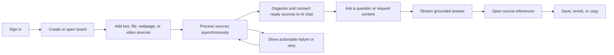
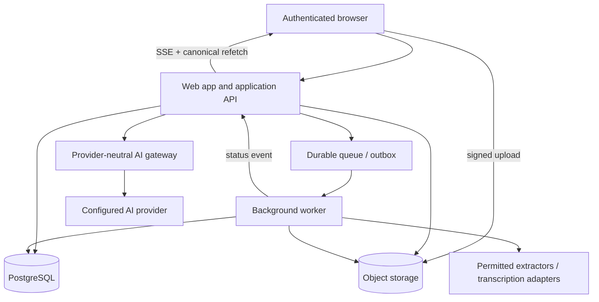
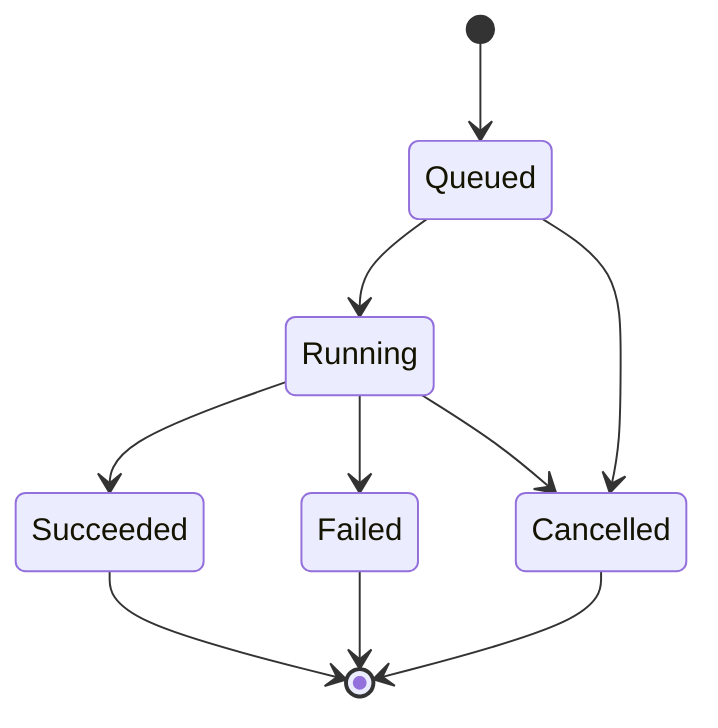

# Visual AI Workspace — Product Specification

| Field | Value |
| --- | --- |
| Status | Approved v0.1 implementation baseline; external-alpha gates remain |
| Last updated | 2026-08-01 |
| Scope | Phase 1 core MVP and private alpha launch gates |
| Working product name | Siftloom; owner approval and professional clearance pending |
| Audience | Product, design, engineering, QA, security, and Codex agents |
| Governing instructions | Root `AGENTS.md`, then this specification, then accepted ADRs |

## 1. How to use this specification

This document defines the required product behavior for the Phase 1 MVP. It is
the implementation baseline until the user approves a replacement or a later
version.

Normative terms have the following meaning:

- **MUST / P0** — required for the private alpha release.
- **SHOULD / P1** — expected when it can be delivered without jeopardizing P0;
  otherwise it moves to the first post-alpha iteration.
- **MAY / P2** — optional or future scope.

When this document conflicts with an explicit user instruction, the user
instruction wins. When an implementation decision has meaningful alternatives,
record it in `docs/architecture.md` or `docs/adr/` rather than silently turning
one implementation into a product requirement.

## 2. Product summary

Build an original, multi-tenant visual AI workspace where users arrange source
material on an infinite canvas, explicitly connect selected sources to an AI
chat node, and receive streamed output linked back to the contributing source
nodes.

The Phase 1 value proposition is:

> Turn mixed source material into a persistent visual research board and
> generate source-grounded content without losing provenance or control of the
> AI context.

The product MUST use independently written code, original branding, original
copy, and an original design system. It MUST NOT copy another product's source
code, private APIs, trademarks, marketing copy, paid templates, or distinctive
visual assets.

## 3. Problem statement

Content creators and researchers commonly work across documents, browser tabs,
video transcripts, notes, and linear AI chats. This creates four recurring
problems:

1. Research loses its spatial and conceptual organization when copied into a
   linear chat.
2. Users cannot easily see or control which sources an AI response used.
3. Long extraction or generation tasks interrupt the rest of the workflow and
   fail without a clear recovery path.
4. Returning to prior work often means reconstructing context, source links,
   and draft history.

The product solves these problems by making the board the durable workspace and
the AI chat one connected node within that workspace.

## 4. Product principles

1. **Canvas first.** The visual board is the product's primary workspace. Chat
   augments the canvas rather than replacing it.
2. **Explicit context.** AI uses only sources the user has connected or
   explicitly selected for the current request.
3. **Visible provenance.** Generated output links back to the exact source nodes
   and source versions used for that generation.
4. **Honest state.** Saving, ingestion, and generation always show their current
   state, failure, and available recovery action.
5. **No silent data loss.** Conflicts and failed writes remain visible and
   recoverable; stale state never silently replaces newer work.
6. **Asynchronous by design.** Slow parsing, fetching, transcription, and AI
   work do not block unrelated board editing.
7. **Tenant safety by default.** Every user-owned record and operation is scoped
   to a workspace on the server and in persistence.
8. **Provider-neutral core.** Model vendors, model identifiers, extractors, and
   storage providers are adapters, not product-domain types.
9. **Original experience.** Functional category parity does not justify copying
   a competitor's identity, copy, or pixel-level design.
10. **Measured expansion.** Complete one reliable vertical slice before adding
    multiplayer, billing, automation, or a broad integration catalog.

## 5. Goals and success measures

### 5.1 User outcome goals

- A new user can create a board and understand the essential canvas actions
  without formal training.
- A user can collect text, PDF, plain-text, webpage, and one supported public
  video source on a single board.
- A user can organize and connect sources without losing acknowledged work
  after refresh or navigation.
- A user can ask an AI chat node a question using only explicitly included
  sources.
- A user can inspect which source nodes contributed to a generated answer.
- A user can understand and safely recover from save, ingestion, and generation
  failures.
- One tenant can never read, mutate, infer metadata about, or generate from
  another tenant's resources.

### 5.2 Activation definition

A user is activated after completing all of the following in one workspace:

1. Creates a board.
2. Adds at least two source nodes.
3. Successfully processes at least one imported source.
4. Includes at least one ready source in an AI-chat scope.
5. Receives one completed answer with a valid source reference.

### 5.3 Initial private-alpha targets

These are directional product targets. They do not replace the release-blocking
correctness and security criteria later in this document.

- At least 80% of observed alpha participants complete the activation journey
  within ten minutes without intervention.
- At least 70% of users who create a board complete one grounded AI response.
- At least 95% of the supported ingestion fixture corpus reaches the correct
  terminal state.
- 100% of rendered source references resolve to an authorized node included in
  the corresponding chat-run context manifest.
- Zero cross-tenant reads or mutations across the authorization test matrix.
- Zero duplicate canonical assistant messages or billable usage events across
  retry, cancellation, and duplicate-delivery tests.
- At least 99% successful autosave acknowledgements in the controlled staging
  environment, with every failure visibly recoverable.

## 6. Personas and jobs to be done

### 6.1 Primary persona — independent content creator

Collects examples, transcripts, documents, and notes, then turns them into
scripts, posts, briefs, outlines, or campaigns. Values speed, spatial
organization, reusable context, and output that remains tied to source material.

### 6.2 Secondary persona — marketer or small-agency operator

Synthesizes client materials and public references into campaign concepts or
content briefs. Values workspace boundaries, provenance, reliable persistence,
and predictable external-service usage.

### 6.3 Secondary persona — researcher or analyst

Compares documents, webpages, and videos to produce summaries or structured
findings. Values explicit source scope, navigable references, and clear
disclosure when sources do not support an answer.

### 6.4 Jobs to be done

- When researching a topic, I want to collect mixed source formats in one
  visual space so I can see and organize the evidence.
- When sources are related, I want to group and connect them so their intended
  role is visually clear.
- When asking AI for help, I want to control exactly which sources it may use so
  unrelated or private material is not included.
- When reading generated content, I want to open the contributing source nodes
  so I can inspect the underlying material.
- When extraction or generation fails, I want to understand what happened and
  retry safely.
- When I return later, I want board geometry, content, links, chat history, and
  processing state to remain intact.
- When working in a workspace, I want confidence that another tenant cannot see
  or mutate my content.

Phase 1 supports an individual operator in a workspace. Membership records and
tenant boundaries exist from the start, but invitation, role-management, and
multiplayer interfaces do not.

## 7. Phase 1 scope

### 7.1 Included P0 scope

- Authentication, secure sessions, and one default personal workspace.
- Server-enforced tenant isolation for every user-owned resource and operation.
- Active and archived board lists.
- Board create, open, rename, archive, and restore.
- Infinite canvas with pan, zoom, fit, selection, multi-selection, drag,
  resize, grouping, ungrouping, connections, and deletion.
- Predictable session-level undo and redo for canvas editing operations.
- A board-level `Recently deleted` view for restoring soft-deleted nodes after
  the editing session ends.
- Text, file, URL/media, group, and AI-chat node types.
- Debounced autosave with dirty, saving, saved, failed, retry, and conflict
  states.
- PDF and UTF-8 plain-text file ingestion.
- Public webpage ingestion through a hardened fetch boundary.
- One compliant public video-source adapter. The target is public YouTube URLs
  where metadata or transcript access is legitimately available; unsupported or
  inaccessible videos fail safely and may direct the user to upload content
  they have permission to process.
- Asynchronous extraction or transcription with visible stages, safe retries,
  and internal cancellation when authority or the source is revoked.
- Streaming and cancellable AI responses through one server-configured default
  provider/model.
- AI context restricted to explicitly connected sources and explicitly
  confirmed one-time selections.
- Clickable answer references back to the exact contributing source nodes.
- Basic rate limiting, quota enforcement, append-only usage metering, and safe
  error reporting.
- Copying a completed AI response to the clipboard.
- Responsive application shell and keyboard-accessible critical actions.
- A semantic board outline/list for users who cannot operate the spatial canvas
  directly.
- Structured operational logs, metrics, health checks, and privacy-safe error
  reporting sufficient to operate a private alpha.

### 7.2 P1 scope after the vertical slice is stable

- Simple workspace-usage summary for the current quota period.
- Browser-local preservation of unsent autosave mutations across a crash or
  accidental refresh.
- Improved partial-extraction messaging and per-source inclusion details.

### 7.3 Explicit non-goals for Phase 1

- Competitor-identical branding, copy, templates, visuals, or pixel-level UI.
- Native mobile or desktop applications.
- Offline-first board editing.
- Team invitations, custom roles, workspace administration, or multiplayer
  presence.
- Public links, board sharing, comments, mentions, approvals, or collaboration
  workflows.
- Checkout, subscriptions, invoices, payment collection, or a billing UI.
- User-facing provider/model selection or simultaneous provider comparison.
- Image generation, brand-voice profiles, reusable content templates, landing
  pages, or carousel generation.
- Search across boards, complete version history, or version comparison.
- Downloadable chat/board exports or automated content-export workflows.
- External API, webhooks, connectors, integrations, or workflow automation.
- Arbitrary social-media importers.
- Authenticated, private, paywalled, DRM-protected, or otherwise restricted
  remote content.
- Guaranteed OCR for image-only PDFs.
- Independent fact checking or claims that grounded output is verified truth.
- Autonomous web browsing, side-effecting AI tools, or use of unselected board
  content.
- Cross-board AI context or persistent user memory.
- A dedicated vector database unless measured source scale or retrieval quality
  demonstrates that it is required.
- User-initiated ingestion cancellation. The system may still terminate work
  when authorization is revoked, a source is deleted, or safety limits fire.
- Permanent deletion controls in the user interface. Phase 1 uses recoverable
  archive and soft-deletion behavior.

## 8. Assumptions and provisional limits

All numeric limits MUST be centrally configured and exposed consistently in
server validation and user-facing guidance. They MUST NOT be scattered as
unrelated constants.

- Each new account receives one default workspace idempotently.
- One server-configured AI provider/model is active behind the common AI
  gateway. Model IDs are configuration, not persisted domain behavior.
- The initial public video target is YouTube, subject to an approved compliant
  access path before implementation is marked complete.
- Users may process only material they are authorized to use. The product does
  not bypass authentication, paywalls, DRM, robots controls, or technical access
  restrictions.
- Proposed private-alpha input limits:
  - Text node: 100,000 UTF-8 characters.
  - Plain-text upload: 5 MB.
  - PDF: 25 MB and 200 pages.
  - Remote webpage response: 5 MB after decoding and decompression.
  - Remote redirects: at most three, with destination revalidation at every hop.
  - Remote connect/read/total fetch timeout: at most 15 seconds total by default.
  - Supported video duration: at most 120 minutes.
- Text-bearing PDFs are supported. OCR may be added later.
- Phase 1 groups are non-nested. A group may contain source nodes but not
  another group or AI-chat node.
- Full canvas authoring targets modern desktop browsers. Tablet layouts remain
  usable; narrow mobile layouts support board inspection and chat access but
  need not support every spatial editing gesture.
- Concurrent editing is limited to multiple tabs or devices belonging to the
  same user. Conflicts are surfaced rather than automatically merged.
- The first shipping UI may use one locale, but all user-facing copy and
  formatting must be centralized for localization. The launch locale is an M0
  product decision.

## 9. Primary experience



### 9.1 Journey J1 — sign in and create a board

1. The user signs in using the configured authentication method.
2. The system resolves or creates the user's default workspace and membership.
3. The user sees an empty board list with a clear create action.
4. The user creates a board and enters its empty canvas.
5. A default board name is provided and can be renamed.

Success: the board appears in the active list and reopens after refresh.

### 9.2 Journey J2 — build and organize a board

1. The user adds text, file, URL/media, group, and AI-chat nodes.
2. The user moves, resizes, selects, groups, and connects nodes.
3. Save state moves from dirty to saving to saved.
4. The user refreshes or reopens the board.

Success: node content, world coordinates, sizes, group membership,
connections, and chat-node placement are preserved.

### 9.3 Journey J3 — import a source

1. The user uploads a supported file or submits a supported public URL.
2. A source node appears promptly in a validating or queued state.
3. The user continues working elsewhere on the board.
4. The node advances through visible processing stages.
5. The job finishes ready, ready with warnings, failed, or cancelled.
6. A failed job presents a safe reason and a retry action when retry is valid.

Success: normalized content and provenance are available without duplicating
the asset, normalized result, job, or usage on retry.

### 9.4 Journey J4 — ask a grounded question

1. The user connects ready source nodes or a group to an AI-chat node.
2. Any one-time selected sources appear as explicit composer chips before send.
3. The user submits a question or content request.
4. The answer streams and can be cancelled.
5. Completed output displays source references.
6. Selecting a reference focuses and highlights the corresponding source node.

Success: the stored run context contains only confirmed source-node versions,
each reference resolves within that context, and one canonical chat run,
assistant message, and set of usage events are stored.

### 9.5 Journey J5 — recover from failure or conflict

1. Autosave, ingestion, or generation fails.
2. The UI retains recoverable work and displays an actionable state.
3. The user retries through an idempotent command.
4. A stale-revision write produces a visible conflict rather than overwriting
   accepted data.

Success: no silent data loss, duplicate canonical message, duplicate usage
event, or duplicate ingestion artifact occurs. An indeterminate external
provider outcome enters reconciliation instead of being retried automatically.

### 9.6 Journey J6 — archive and restore

1. The user archives a board after confirmation.
2. The board leaves the active list and appears under archived boards.
3. The user restores the board.
4. All acknowledged board state becomes available again.

Success: archive and restore are tenant-authorized and do not permanently
delete content.

## 10. Functional requirements and acceptance criteria

### 10.1 Authentication and tenancy

#### AUTH-001 — Protected application (P0)

The user MUST be able to sign in and sign out using one configured, secure
authentication method.

Acceptance criteria:

- Unauthenticated application routes redirect to or display the sign-in flow.
- Sign-out invalidates the active session.
- Expired or revoked sessions cannot access application APIs, request or renew
  signed URLs, read ingestion status, or subscribe to chat streams. A previously
  issued ordinary presigned URL is a bearer token until its deliberately short
  TTL expires; immediate revocation requires a controlled download proxy or a
  revocable delivery-token design.
- Session loss does not silently discard dirty local board mutations; the UI
  retains them and prompts the user to sign in again or copy the work.

#### AUTH-002 — Default workspace (P0)

- The first successful sign-in creates one default workspace and owner
  membership if they do not already exist.
- Repeating the provisioning request is idempotent.
- Phase 1 presents no team-invite or role-management UI.

#### AUTH-003 — Object-level tenant authorization (P0)

- Every board, node, edge, asset, artifact, job, chat, run, message, source
  reference, usage event, and signed-object request belongs to or derives an
  immutable `workspace_id`.
- Each read and mutation verifies active membership on the server.
- Child resources are never resolved by opaque ID alone; their parent board,
  chat, asset, and workspace relationships are verified.
- Background workers repeat the same scope checks before reading assets or
  writing results.
- Long-running work rechecks authority before privileged reads and canonical
  finalization. Revocation stops future work and prevents a result from being
  exposed under stale authority.
- A second tenant cannot infer whether a guessed resource ID exists. Responses
  use a consistent non-disclosing authorization/not-found behavior.
- Any confirmed cross-tenant access is release-blocking.

### 10.2 Board lifecycle

#### BOARD-001 — Board list and creation (P0)

- The active board list loads only boards in the current workspace, ordered by
  most recent meaningful update.
- An empty state explains how to create the first board.
- A user can create a board with a trimmed name from 1 to 120 characters.
- An omitted name uses a localized equivalent of `Untitled board`.
- Duplicate create delivery with the same mutation ID creates one board.

#### BOARD-002 — Open and rename (P0)

- Opening a board loads one canonical graph snapshot with its current revision.
- Rename updates the list and open board without requiring a full reload.
- Rename survives refresh and exposes a safe retry when persistence fails.

#### BOARD-003 — Archive and restore (P0)

- Archive requires confirmation and removes the board from the active list.
- Archived boards remain readable from an archived-board view and are
  recoverable during the configured retention period.
- Restore returns the complete board to the active list.
- Archive and restore are idempotent and tenant-authorized.
- The UI provides no permanent-delete action in Phase 1.

### 10.3 Canvas and nodes

#### CANVAS-001 — Navigation (P0)

- Users can pan, zoom in, zoom out, reset or fit the viewport, and return focus
  to the selected node.
- Node positions persist in finite world coordinates and round-trip without
  viewport-dependent drift.
- Buttons and keyboard alternatives exist for critical navigation gestures.

#### CANVAS-002 — Node editing (P0)

- Users can create, select, multi-select, move, resize, and delete eligible
  nodes.
- Node content and node geometry update through separate state paths.
- Invalid dimensions, non-finite coordinates, or malformed payloads are
  rejected without partially mutating the graph.
- Large binary or extracted content is not stored in board graph payloads.

#### CANVAS-003 — Supported node types (P0)

- `text` — editable plain or safely rendered rich text.
- `asset` — uploaded PDF or plain-text source and its processing state.
- `url` — webpage or configured video source and its processing state.
- `group` — non-nested container for eligible source nodes.
- `chat` — canvas representation linked to one persisted chat record.
- Each persisted payload is a runtime-validated, versioned discriminated union.

#### CANVAS-004 — Groups (P0)

- Users can create a group, add or remove eligible nodes, move a group, and
  ungroup it.
- Moving a group translates its children while preserving relative positions.
- Ungrouping preserves each child's world position.
- Groups cannot contain groups or chat nodes in Phase 1.
- Deleting a group requires a clear choice between ungrouping its children and
  deleting eligible children; the default safe action is ungroup.

#### CANVAS-005 — Context connections (P0)

- Users can create and remove visible directed source-to-chat and
  group-to-chat context connections.
- Self-connections, duplicate active edges, cross-board edges, and unsupported
  source/target combinations are rejected.
- Group expansion includes eligible ready descendants, excludes unsupported or
  not-ready descendants, and deduplicates sources in a stable order.
- Removing a connection affects future chat runs but never rewrites the context
  manifest of a historical run.

#### CANVAS-006 — Undo and redo (P0)

- Create, move, resize, group, ungroup, connect, disconnect, and
  delete operations are undoable during the active editing session.
- A new edit after undo clears the redo branch.
- Undoing a saved operation creates a new mutation; it does not secretly rewrite
  server history.
- Undo and redo never cross the authorization or board boundary.

#### CANVAS-007 — Keyboard operation (P0)

- Critical actions have keyboard-operable paths with visible focus and no
  keyboard traps.
- Common browser and assistive-technology shortcuts are not overridden.

#### CANVAS-008 — Semantic board outline (P0)

- A synchronized semantic outline/list exposes nodes, groups, context
  relationships, processing states, and citations without requiring spatial
  pointer gestures.
- Users can focus, open, edit, connect, and delete eligible nodes through this
  representation.
- Selecting an outline item focuses the corresponding visual node when the
  canvas is visible.

#### CANVAS-009 — Recently deleted nodes (P0)

- Deleting a node immediately removes it and its active incident edges from the
  canvas, shows a session-level undo action, and places the node in the board's
  `Recently deleted` view.
- The user can restore a node after refresh during the configured recovery
  period.
- Restore also restores an incident edge only when both endpoints still exist
  and the edge remains valid; otherwise the node is restored without that edge
  and the UI explains the omission.
- Permanent purge is not exposed in the Phase 1 UI.

### 10.4 Autosave and conflict recovery

#### SAVE-001 — Visible autosave (P0)

- A local mutation marks the board dirty immediately.
- A debounced save begins between 500 and 1,000 ms after the final edit in a
  burst; the exact value is centrally configured.
- The UI exposes `Saving`, `Saved`, `Save failed`, and `Conflict` states.
- A failed save retains the pending mutation and offers retry with bounded
  backoff.
- Navigation or close attempts flush pending changes or display an unsaved-work
  warning.
- A successful refresh reproduces the last acknowledged graph state.
- Save status is announced accessibly without repeatedly stealing focus.

#### SAVE-002 — Idempotency and conflicts (P0)

- Every autosave batch carries a stable mutation ID and the last known relevant
  revision.
- Duplicate delivery returns the prior canonical result and does not apply the
  mutation twice.
- A stale conflicting write receives a stable conflict response with the latest
  canonical revision.
- The client retains its unsaved edit and offers reload or deliberate reapply;
  it never silently applies last-write-wins to conflicting content.
- Out-of-order save responses cannot move the client from a newer acknowledged
  revision back to an older one.

#### SAVE-003 — Multiple-tab behavior (P0)

- Two tabs editing non-overlapping records may reconcile through canonical
  revisions.
- Two tabs editing the same stale record receive a visible conflict in at least
  one tab.
- Refresh, crash simulation, offline/reconnect, and navigation tests prove that
  the latest acknowledged state is never silently lost.

### 10.5 Source ingestion

#### INGEST-001 — Supported source inputs (P0)

- Editable manual text.
- PDF and UTF-8 plain-text uploads.
- Public webpage URL.
- One configured public video-source URL, targeting compliant public YouTube
  metadata/transcript access.
- The UI displays supported types and configured limits before submission.
- Unsupported, oversized, encrypted, private, restricted, or inaccessible
  content receives a safe and actionable error.

#### INGEST-002 — Signed upload lifecycle (P0)

- The server authorizes an upload intent before issuing a short-lived signed
  URL scoped to one object and one operation.
- Upload completion revalidates workspace ownership, expected object key,
  declared size, actual size, detected MIME signature, and supported type.
- Invalid or incomplete uploads are not enqueued for parsing.
- Completion is idempotent and never exposes storage credentials or public
  bucket access.
- Orphaned or quarantined objects are removed through a bounded cleanup job.

#### INGEST-003 — Asynchronous processing state (P0)

Canonical logical-job status and execution-attempt state are stored separately:

- Logical job status: `queued | running | succeeded | failed | cancelled`.
- Attempt status: `queued | running | succeeded | failed | cancelled`.
- Attempt stage: `validating | fetching | extracting | transcribing |
  normalizing | storing`.
- A succeeded logical job may contain warnings; the UI may present this as `Ready with
  warnings` without inventing another canonical status.

Acceptance criteria:

- Source submission returns promptly and does not hold an ordinary request open
  for extraction or transcription.
- The canvas remains interactive while jobs run.
- Job, attempt, and stage survive refresh and progress monotonically within an
  attempt.
- Terminal failures identify retryability with a stable safe error code.
- System cancellation caused by source deletion, authority revocation, or a
  safety limit stops downstream work where possible and prevents a stale worker
  from overwriting a newer attempt. Phase 1 has no user-facing cancel command.
- No job remains permanently running after lease expiry, worker crash, or
  deployment restart.

#### INGEST-004 — Safe remote retrieval (P0)

- Only explicitly supported HTTP(S) protocols and ports are allowed.
- Credentials in URLs are rejected and ambient user/server credentials are
  never forwarded.
- Every DNS resolution and redirect hop is revalidated.
- Loopback, private, link-local, multicast, cloud-metadata, and other prohibited
  IPv4 and IPv6 destinations are blocked.
- Redirect count, connect/read/total time, response bytes, decompressed bytes,
  parser CPU/time, PDF pages, and extracted-text size are bounded.
- DNS rebinding, encoded-IP, decompression-bomb, malformed-file, and slow-response
  fixtures fail without reaching protected test endpoints.
- The product does not bypass access controls, paywalls, DRM, or platform terms.

#### INGEST-005 — Normalization and provenance (P0)

- A successful job stores a versioned extraction artifact outside board graph
  state.
- Normalized content is divided into ordered addressable segments with source
  location metadata such as PDF page, text range, or media timestamp when
  available.
- Provenance includes original URL or filename, retrieval time, source MIME,
  extractor version, and content hash where appropriate.
- Duplicate content may be deduplicated for processing without merging or
  losing distinct user-facing node identities.

#### INGEST-006 — Retry and idempotency (P0)

- Every logical submission, job, and attempt has a stable idempotency key.
- Duplicate submission, enqueue, callback, or completion events cannot create a
  second canonical asset, artifact, or usage event.
- Retryable failures use bounded exponential backoff with jitter and a maximum
  attempt count.
- Before a paid external extraction/transcription call, persist a
  `ProviderAttempt` and use provider idempotency when supported. If the provider
  may have accepted the call but the outcome is indeterminate and cannot be
  reconciled, fail the logical job with a reconciliation-required error and do
  not retry that external operation automatically.
- An automatic retry creates a new immutable attempt under the same logical job;
  the failed attempt remains terminal.
- A manual retry after a terminal logical-job failure creates a new logical job
  linked to the prior job and the same source. It does not move the failed job
  back to queued or overwrite a newer successful artifact.
- At most one attempt for a logical job may actively hold the processing lease.
- Events may be duplicated or out of order; clients deduplicate by event ID and
  ignore revisions older than canonical state.

### 10.6 AI chat and source grounding

#### CHAT-001 — Chat node and history (P0)

- A user can create one or more AI-chat nodes on a board.
- Each chat node references one chat record in the same workspace and board.
- User and assistant messages persist in canonical order and survive refresh.
- Persisted history is visible to the user but is not automatically eligible as
  model context; the rules in `CHAT-003` govern history inclusion per run.
- Phase 1 chats have no autonomous web access, arbitrary network tools, or
  side-effecting tools.

#### CHAT-002 — Explicit context scope (P0)

- Persistent context consists only of valid incoming source/group context
  connections.
- One-time selected context is shown as explicit composer chips and confirmed
  before send.
- Every Phase 1 AI request requires at least one eligible explicitly connected
  or confirmed source. Phase 1 does not provide an ungrounded general-chat mode.
- At send time, the server reauthorizes every source and creates immutable
  `ContextSourceSnapshot` records plus a manifest containing node IDs, node
  revisions, exact supplied text or artifact segment versions, content hashes,
  included history-message IDs, and any exclusions.
- Sources added or changed after send do not retroactively alter a historical
  run.
- Deleted, unauthorized, failed, cancelled, or not-ready sources are excluded
  with a safe visible reason.
- Sending is blocked when no eligible source remains.
- No node from another board or workspace can enter the manifest.

#### CHAT-003 — Deterministic context assembly (P0)

- Context assembly uses a centrally configured global token budget with explicit
  allocations for privileged instructions, recent chat history, source content,
  and output reserve.
- A prior user/assistant turn may enter a new run only when its recorded source
  lineage is a subset of the new run's currently authorized versioned source
  scope. Subset comparison uses snapshot identity, including node ID and
  revision plus artifact version or content hash where applicable; node ID alone
  is insufficient. Turns derived from disconnected, deleted, edited,
  reprocessed, or otherwise excluded source versions are omitted and the UI
  indicates that history context was reduced.
- Included history-message IDs are frozen in the new run manifest. Historical
  assistant content never becomes an indirect path around explicit source
  selection.
- Source expansion, deduplication, ordering, chunk selection, per-source
  fairness, and truncation are deterministic and covered by tests.
- Long-source retrieval, if needed, searches only the frozen authorized source
  set. A dedicated vector database is not required for Phase 1.
- The UI indicates when any source was partially included or omitted by the
  budget.
- Imported content is strongly delimited and treated as untrusted quoted data,
  never as privileged instructions.
- Embedded requests to reveal secrets, broaden scope, call tools, or change
  policy cannot change server-enforced authorization, source scope, the Phase 1
  no-tools boundary, or secret handling. Model wording remains untrusted and is
  still validated and sanitized.

#### CHAT-004 — Streaming and cancellation (P0)

- A send creates one chat run with a stable idempotency key.
- An idempotent create command returns the run ID; a separate subscription
  streams that run through SSE or an equivalent one-way protocol.
- The user can cancel an active run.
- Streaming deltas are ephemeral; the server-assembled final message is the
  canonical assistant message.
- Replaying the same create command returns the same run and cannot create a
  second canonical assistant message or usage event.
- Before an external call, the system persists a provider-attempt record and
  uses a provider idempotency key when the provider supports one.
- If a provider may have accepted a paid request but its outcome cannot be
  determined after a crash and the provider offers no reconciliation or
  idempotency mechanism, the run becomes `reconciliation_required`; the system
  does not retry automatically or pretend exactly-once external execution.
- Each run reaches exactly one terminal status: `completed`, `cancelled`,
  `failed`, or `reconciliation_required`.
- Canonical assistant-message, message-source, and usage-event finalization is
  exactly once even when external provider execution cannot be proven exactly
  once.
- Provider timeout or failure preserves the user message and presents retry.
- Retry creates an explicit new run and informs the user that additional usage
  may apply, especially after an indeterminate external result.

#### CHAT-005 — Source references (P0)

- Source handles supplied to the model map to entries in the frozen context
  manifest.
- Before persistence, generated source handles are validated against that
  manifest; unknown or malformed handles are removed or marked invalid.
- Every normally completed grounded answer contains at least one validated
  source reference. If validation leaves no valid reference, the run ends with
  terminal status `failed` and stable error code `citation_validation_failed`
  rather than presenting the output as a successful grounded answer; actual
  external usage is still recorded once.
- Every rendered reference resolves to a node/version included in that run.
- Selecting a reference focuses or highlights the exact source node and, when
  supported, the relevant page or timestamp.
- If the current node revision differs from the generation-time revision, the
  UI shows `Source changed` and offers a read-only view of the immutable
  generation-time snapshot. This run snapshot is not a general board-version
  history feature.
- A soft-deleted source may be viewed through its authorized immutable snapshot
  or restored. A purged or no-longer-authorized source displays an unavailable
  state and is never silently rebound to another node.
- If sources do not support the requested answer, output states the limitation
  instead of retrieving unselected board content.
- The UI labels output as grounded in selected sources, not independently fact
  checked.

#### CHAT-006 — Safe rendering (P0)

- Model output, Markdown, links, generated HTML, and embedded media are treated
  as untrusted before rendering.
- Unsafe HTML, scripts, event handlers, URL schemes, and open-redirect patterns
  are removed or blocked.
- Streaming updates do not steal focus or announce every token to assistive
  technology.

### 10.7 Usage, limits, and abuse controls

#### USAGE-001 — Append-only metering (P0)

- Billable input, cached input, output, transcription, image, and other vendor
  dimensions are recorded separately when the provider reports them.
- Every usage event links to workspace, logical request, operation, provider
  result, and one unique idempotency key.
- Usage events are append-only. Quota summaries are derived from auditable
  events rather than an untracked mutable counter.
- Duplicate delivery, callback, retry, cancellation, or partial stream cannot
  duplicate usage.

#### USAGE-002 — Quotas and reservations (P0)

- Authentication, authorization, input limits, rate limits, quota, and
  concurrency limits run before paid external work.
- Concurrent operations reserve quota atomically where a race could exceed a
  hard limit.
- Unused reservation is released after safe terminal failure or cancellation.
- Actual provider-reported usage is committed at most once, including after
  partial streams and timeouts.
- Limit errors state when the user may retry or what action is required without
  exposing internal thresholds that aid abuse.

#### USAGE-003 — Abuse protection (P0)

- Apply appropriate per-account, workspace, session/IP, upload, URL-fetch,
  ingestion-retry, and chat limits.
- Vendor adapters use total timeouts, bounded retries, backoff, circuit or
  concurrency limits, and retryable-versus-terminal error classification.
- Provider degradation does not prevent loading or editing existing boards.

### 10.8 Errors, notifications, and recovery

#### ERROR-001 — Stable safe errors (P0)

- User-facing errors explain what failed and the next available action.
- API and background errors use stable machine-readable codes and a request ID.
- Responses never expose provider secrets, internal network addresses, stack
  traces, signed URLs, or authorization details.
- Retryability is explicit and does not create automatic retry storms.

The conceptual API error envelope is:

```json
{
  "code": "STABLE_MACHINE_CODE",
  "message": "Safe user-facing message",
  "retryable": false,
  "requestId": "opaque-id",
  "fieldErrors": []
}
```

#### EVENT-001 — Recoverable client notifications (P0)

- Every event has an opaque event ID. Canonical-resource notifications carry a
  `resourceRevision`; chat deltas carry a separate monotonically increasing
  `streamSequence`. The two numbers are not interchangeable.
- Ingestion notifications are hints; reconnecting clients refetch the canonical
  job, attempt, and artifact state.
- Starting a chat run and subscribing to its stream are separate operations, so
  reconnecting never creates another provider request.
- The server keeps a bounded short-lived chat replay buffer or cumulative-text
  snapshot. A reconnect resumes after the last sequence when available; if the
  gap cannot be replayed, the server sends one cumulative `chat.snapshot` event
  or the client waits for and refetches the terminal canonical message.
- Duplicate or out-of-order events do not regress canonical client state.
- The client supports `Last-Event-ID` or an equivalent cursor, with canonical
  polling/refetch as a degraded recovery path.

Conceptual event envelope:

```json
{
  "eventId": "opaque-id",
  "type": "ingestion.status.changed",
  "aggregateId": "opaque-id",
  "resourceRevision": 4,
  "streamSequence": null,
  "occurredAt": "ISO-8601 timestamp",
  "data": {}
}
```

Minimum event families:

- `ingestion.status.changed`
- `chat.started`
- `chat.delta`
- `chat.snapshot`
- `chat.completed`
- `chat.failed`
- `chat.cancelled`
- `chat.reconciliation_required`

### 10.9 Accessibility and responsive behavior

#### A11Y-001 — Phase 1 accessibility target (P0)

The product targets WCAG 2.2 AA for the application shell and critical journey.

- Every critical journey has a keyboard-only path: create/open a board; create,
  select, edit, move, resize, group, connect, and delete nodes; undo/redo; import
  and retry; send/cancel chat; open a source reference; archive and restore.
- Where a spatial gesture cannot be made directly accessible, provide a menu,
  form, or semantic-list alternative.
- Focus order is predictable, focus is visible, Escape cancels transient UI,
  and focus returns to the triggering control after a dialog.
- Saving, ingestion completion, errors, quota failures, and chat completion use
  restrained live-region announcements.
- Color is never the only indicator of state or connection meaning.
- Text and controls meet WCAG 2.2 AA contrast targets.
- Meaning remains usable at 200% zoom and key content remains accessible at
  400% zoom/reflow where the canvas interaction model permits.
- Reduced-motion preferences disable unnecessary canvas and status animation.
- Narrow layouts keep critical error, retry, confirmation, and chat actions
  keyboard- and touch-reachable.

#### UX-001 — Complete product states (P0)

- Board list, board load, canvas, every node type, ingestion, chat, usage, and
  archive/restore define all applicable empty, loading, success, partial,
  failure, conflict, cancelled, and retry states.
- Destructive actions are recoverable or explicitly confirmed.
- Upload progress, ingestion state, and AI streaming do not block unrelated
  board work.

#### COPY-001 — Copy generated output (P0)

- A user can copy a completed assistant message as plain text or Markdown.
- Copying is client-side and does not create another model request or usage
  event.
- Downloadable chat/board export and import are outside Phase 1.

## 11. Domain model and invariants

The database is canonical. Queue events, browser state, and SSE messages are
delivery mechanisms or caches, not sources of truth.

| Entity | Purpose | Required invariants |
| --- | --- | --- |
| `User` | Authenticated principal reference | Stable opaque ID; no provider secrets |
| `Workspace` | Tenant boundary | Every user-owned aggregate belongs to one workspace |
| `WorkspaceMembership` | Principal-to-tenant authorization | Unique user/workspace pair; active state checked server-side |
| `Board` | Recoverable visual workspace | Workspace scoped; revisioned; archived/soft-deleted timestamp |
| `Node` | Canvas object | Same workspace/board; finite world geometry; versioned validated payload; revision; optional same-board parent group |
| `Edge` | Directed context connection | Endpoints exist on same board; unique active source/target/type tuple |
| `Asset` | Workspace-scoped binary or remote-source identity | Tenant-scoped object key; nullable hash until verified; source type and provenance |
| `IngestionJob` | Logical processing request | Terminal status is immutable; retry lineage; current/successful attempt reference |
| `IngestionAttempt` | One leased worker execution | Staged, retry-bounded, system-cancellable, idempotent, terminal state immutable |
| `ExtractionArtifact` | Versioned normalized result | Immutable version per successful attempt; belongs to one asset |
| `ExtractionSegment` | Addressable source content | Ordered; stable segment ID; page/time/text location where available |
| `Chat` | Conversation associated with a chat node | Same workspace and board as node |
| `Message` | Canonical user or assistant content | Ordered; immutable source snapshot relationship; one terminal state |
| `ChatRun` | One generation attempt | Idempotency key; context manifest; stream sequence; terminal/reconciliation state |
| `ProviderAttempt` | Durable record created before an external paid call | Operation/idempotency key, provider request ID when available, known/indeterminate outcome, normalized usage |
| `ContextSourceSnapshot` | Immutable run input and lineage | Node/revision, content hash, exact supplied text or immutable artifact segments, authorization scope |
| `MessageSource` | Validated answer-to-source link | References a context snapshot and its node/artifact/segment lineage |
| `UsageEvent` | Auditable external usage | Append-only; unique operation/event key; billable dimensions separated |

Global invariants:

- Tenant-owned records carry `workspace_id` directly when practical. Queries
  use deny-by-default tenant-scoped repository helpers and database constraints
  or row policies where appropriate.
- Stable opaque IDs and `created_at` / `updated_at` timestamps are required.
- Conflict-sensitive records carry a revision or version.
- Node payload schema version is persisted and migratable.
- A node has at most one `parent_group_node_id`; the parent must be a group on
  the same board. A group cannot have a parent group in Phase 1.
- Asset binaries and full extraction output stay outside graph JSON.
- An asset is workspace-scoped and may be referenced by multiple nodes in that
  workspace. Phase 1 does not expose cross-board asset reuse in the UI. A node
  and its referenced chat belong to the same workspace and board; a referenced
  asset must belong to the same workspace.
- `Asset.content_hash` may be null while upload/fetch verification is pending
  and must be populated before an extraction artifact becomes ready.
- Nodes and edges cannot cross boards.
- `IngestionJob`, `IngestionAttempt`, `ChatRun`, `ProviderAttempt`, message
  finalization, and `UsageEvent` use unique idempotency keys.
- Failed and cancelled ingestion attempts remain terminal. Automatic retry
  creates another attempt; manual retry after terminal job failure creates a
  linked logical job.
- An assistant message becomes canonical exactly once. Usage events are never
  updated in place.
- Each chat run stores immutable source snapshots sufficient to reconstruct the
  exact text supplied to the model without requiring complete board version
  history.
- Soft-deleted or archived resources do not enter new chat contexts.

## 12. System context and component responsibilities



### 12.1 Trust boundaries

- Browser input, uploaded files, remote URLs, extracted content, and model output
  are untrusted.
- Authorization, tenant scoping, privileged prompts, quota enforcement, signed
  URL creation, and provider credentials remain server-side.
- The database is canonical. The object store is canonical for binaries;
  database records authorize and describe those objects.
- Queue and SSE delivery may be duplicated, delayed, or out of order.
- Board editing remains available when ingestion or model providers are
  degraded.

### 12.2 Canvas UI

- Wrap the chosen canvas library behind project-owned components and domain
  types.
- Separate geometry state, node content, upload progress, ingestion state, and
  streaming chat state to avoid broad rerenders.
- Own optimistic edits, undo/redo, autosave status, conflicts, and recovery.
- Keep AI chat represented as a board node.

### 12.3 Application/API layer

- Runtime input validation, authentication, tenant authorization, rate/quota
  checks, idempotency, revision checks, and stable error mapping.
- Board graph queries/mutations, signed upload lifecycle, ingestion commands,
  chat-run lifecycle, and usage summaries.
- Long extraction and transcription never run inside an ordinary request.
- Streaming generation uses a dedicated cancellable streaming endpoint.

### 12.4 Domain modules

- Boards and graph.
- Assets and ingestion.
- Chat, context assembly, and source grounding.
- Usage, limits, and permissions.
- Domain types do not depend on provider SDK or canvas-library types.

### 12.5 Persistence and dispatch

- PostgreSQL repositories with checked-in forward migrations.
- S3-compatible storage for binaries and large derived artifacts.
- Durable queue with leased jobs, bounded concurrency, retry classification,
  backoff, cancellation, and stale-worker protection.
- Use a transactional outbox or equivalent mechanism so a committed job request
  cannot be lost between the database and queue.

### 12.6 AI gateway

- Common streaming, cancellation, error, capability, and usage contract.
- Provider-specific SDK types remain inside adapters.
- Context assembly, prompt-injection boundaries, citation validation, and usage
  finalization remain project-owned logic.
- Provide deterministic test fakes. Automated tests and CI never call a live
  paid model by default.

## 13. Conceptual API behavior

This section defines capabilities, not final route names.

Queries:

- Resolve current user and workspace membership.
- List active and archived boards.
- Load one canonical board graph snapshot and revision.
- List recoverable recently deleted nodes for one authorized board.
- Read asset, artifact, and ingestion status.
- Read canonical chat history and messages.
- Read an authorized generation-time source snapshot through a message
  reference.
- Read a safe workspace-usage summary when the P1 usage UI is implemented.

Commands:

- Create, rename, archive, and restore a board.
- Apply a validated batch of node and edge mutations.
- Restore a soft-deleted node and any still-valid incident edges.
- Create and finalize a file-upload intent.
- Submit webpage or video ingestion.
- Retry a terminal retryable ingestion job.
- Start or cancel a chat run.

Every mutation includes or derives:

- Authenticated workspace scope.
- Runtime-validated payload.
- Stable mutation/idempotency ID.
- Expected revision for conflict-sensitive writes.
- Returned canonical resource revision.

The client never supplies a trusted tenant identity. It may identify a desired
workspace or board, but the server resolves membership and rejects mismatched
parent/child IDs.

## 14. Processing lifecycles

### 14.1 Ingestion lifecycle



This state diagram applies to one logical job. `Failed` and `Cancelled` are
terminal. A manual retry creates a new linked logical job. Within a running job,
each worker execution is an immutable attempt; an automatic retry creates a new
attempt rather than moving a failed attempt back to queued.

Detailed attempt stages are validating, fetching, extracting or transcribing,
normalizing, and storing.

Required behavior:

1. Authorize workspace and enforce source/quota limits.
2. For files, verify actual object bytes, signature, size, and ownership after
   the signed upload completes.
3. For URLs, repeat network safety checks in the worker for every resolution and
   redirect.
4. Atomically persist the asset/job intent and durable dispatch record.
5. Create an attempt, claim its worker lease, and run one bounded adapter
   execution.
6. Normalize output into ordered source segments with provenance.
7. Persist the attempt outcome. On success, persist the artifact and logical-job
   success atomically; after a terminal or exhausted failure, persist logical-job
   failure before notifying clients.
8. Automatically create another attempt only for a classified retryable failure
   within the configured maximum while the logical job remains non-terminal.
9. Prevent cancellation or a stale worker from overwriting a newer terminal
   result.

### 14.2 Autosave lifecycle

```text
clean -> dirty -> saving -> saved
                  |  |
                  |  -> conflict -> retained local edit -> reload or reapply
                  -> failed -> retained local edit -> retry
```

Acknowledged server state is canonical. Dirty client state remains explicitly
visible until acknowledged or deliberately discarded by the user.

### 14.3 Chat-run lifecycle

```text
created -> streaming -> completed
                    -> cancelled
                    -> failed
                    -> reconciliation_required
```

- A retry creates a new run linked to the same user message.
- A terminal run cannot transition again.
- Streaming deltas are not canonical messages.
- Assistant message, validated message sources, and usage events finalize once
  under an idempotent transaction or equivalent protocol.
- `reconciliation_required` is terminal for automatic processing. It represents
  an external provider outcome that cannot safely be inferred or retried; an
  operator or provider reconciliation path resolves usage separately.

## 15. AI context assembly contract

For each chat run, the server MUST:

1. Authorize the chat, board, workspace, and current membership.
2. Resolve only incoming context connections and confirmed one-time source
   selections.
3. Expand non-nested groups into eligible source nodes.
4. Create immutable source snapshots containing the exact supplied text (or
   references to immutable artifact segments), node/artifact revisions, hashes,
   and source location metadata.
5. Include a prior user/assistant turn only when its versioned snapshot lineage
   is a subset of the new run's currently authorized snapshot identities,
   comparing node revision and artifact version/content hash rather than node ID
   alone; record included history message IDs in the manifest.
6. Freeze snapshot IDs, node revisions, artifact versions, segment IDs, and
   exclusions in a context manifest.
7. Exclude deleted, unauthorized, failed, cancelled, or not-ready sources.
8. Deduplicate identical content while preserving every contributing node
   identity for navigation.
9. Apply a configured token budget with stable source ordering, per-source
   fairness, and deterministic truncation.
10. Wrap imported content as untrusted data with stable source handles.
11. Send the provider only the authorized assembled context.
12. Validate generated handles against the manifest before storing references;
    require at least one valid reference for a normally completed run.
13. Recheck current authority before exposing or canonically finalizing the
    result.
14. Finalize the canonical assistant message, sources, and actual usage exactly
    once.

If source content is excluded or truncated, the client MUST make that visible.
Source-grounded output MUST NOT be described as independently fact checked.

## 16. Non-functional requirements

### 16.1 Supported performance profile

The provisional reference environment is a 2021-class laptop equivalent to an
Apple M1 with 8 GB RAM, a current stable Chromium browser, a 1440 x 900 viewport,
and no artificial CPU throttling. M0 MUST record the exact CI/manual reference
device and browser versions.

The proposed standard performance fixture contains:

- 200 mixed nodes.
- 300 edges.
- At least 30 visible nodes.
- One active drag or pan.
- One ingestion-progress stream.
- One AI-response stream.

These values are provisional targets, not hard release gates until M0 measures a
canvas prototype, fixes the exact fixture and measurement method, and records an
approved baseline. Once approved in M0, the resulting numbers become P0 M2/M5
gates.

- Pan, zoom, and drag target p95 frame time at or below 20 ms on the standard
  fixture, equivalent to at least 95% of sampled frames meeting that budget.
- Pointer-to-paint latency remains below 50 ms at p95.
- No single main-thread task exceeds 200 ms during the canonical path.
- After the first five-minute warm-up, retained post-GC heap should grow by no
  more than 20% between minutes 5 and 15 of the deterministic soak, excluding
  documented bounded caches. M0 must confirm a reliable measurement method.
- Saving state appears within 100 ms after a local mutation.
- Save acknowledgement reaches the client within one second at p95 after the
  configured debounce, excluding an intentionally degraded network test.
- Ordinary authenticated API reads complete below 500 ms p95 and writes below
  750 ms p95 in staging, excluding third-party processing.
- Ingestion submission is acknowledged within one second and the first visible
  queued/running status appears within two seconds.
- With a deterministic fake provider, the chat-start stream event appears within
  one second and application overhead before the provider stream is below 500 ms
  at p95. Real-provider time to first content targets five seconds under normal
  conditions but is an observed external metric, not a deterministic CI gate.
- Provider streaming and ingestion updates do not rerender every unaffected
  node.

### 16.2 Reliability and recovery

- Last-acknowledged board geometry, content, groups, and edges survive refresh.
- Board viewing and editing continue during extraction or AI-provider outages.
- Jobs use leases, bounded attempts, dead-letter/manual retry, and stale-worker
  protection.
- Duplicate delivery produces no duplicate canonical artifact, message, or usage
  event. A paid call with an indeterminate external outcome is not retried
  automatically and enters reconciliation.
- P0 requires a successful backup/restore smoke test and concise response notes
  for stuck ingestion, save failures, and suspected tenant isolation failure.
- A 99.5% monthly application availability target and formal RPO/RTO are P1
  post-alpha operational objectives to set after deployment measurements; they
  are not pre-release evidence or a public SLA.

### 16.3 Security

- Deny-by-default tenant authorization applies to browser, API, worker, storage,
  stream, chat cancellation, retry, generation-time snapshot retrieval, and
  source-reference operations.
- Signed URLs are exact-object, exact-action, short-lived, and issued only after
  authorization.
- File validation checks extension, declared MIME, detected signature, declared
  and actual size, parser limits, and ownership.
- Remote retrieval blocks SSRF, DNS rebinding, unsafe redirects, excessive
  decompression, unsupported types, and credential forwarding.
- Rich text, extracted HTML, filenames, Markdown, links, and model output are
  sanitized against XSS and unsafe navigation.
- State-changing browser requests use appropriate CSRF protection, secure
  sessions, restrictive CORS, and a restrictive Content Security Policy.
- Provider/storage credentials and privileged prompts never enter browser
  bundles or client responses.
- Secret scans and dependency vulnerability review run before release.

### 16.4 Privacy and data lifecycle

- The application does not use private workspace content for its own model
  training.
- Provider transmission, subprocessors, retention, and the difference between
  archive and deletion are disclosed before external alpha.
- Logs exclude raw documents, full prompts and responses, signed URLs, cookies,
  authorization headers, credentials, and user-private content.
- Logs may include scoped opaque IDs, durations, safe status/error codes, byte
  and token counts, and redacted provider metadata.
- Before external alpha, deletion is supported either through user controls or
  a documented operator workflow that covers database rows, objects, artifacts,
  context snapshots, indexes, queued work, caches, and derived data.
- The archive/soft-delete recovery period is an M0 decision and centrally
  configured.
- Users are informed that they must have the right to process imported content.

### 16.5 Accessibility

- Target WCAG 2.2 AA for the application shell and canonical journey.
- Automated accessibility tooling is necessary but not sufficient; keyboard
  and screen-reader testing is required.
- Canvas-only information has a semantic alternative when required to complete
  a critical task.
- Status announcements are useful but do not announce every stream token or
  steal focus.
- Connection handles and critical controls have accessible names and adequate
  pointer/touch target sizes.
- Reduced motion, high zoom, narrow viewport, and non-color state communication
  are tested.

### 16.6 Browser support

- Private-alpha full canvas authoring supports the current stable releases of
  Chrome, Edge, Safari, and Firefox, subject to M0 verification. Older versions
  are best effort until a compatibility policy is approved.
- The automated canonical E2E gate runs Chromium, WebKit, and Firefox projects.
  Release smoke tests run in current Edge and Safari on their native browser
  builds, manually or through supported CI browser channels.
- Narrow responsive support includes board inspection, errors/retry, source
  status, and chat access. Full gesture parity is not required on phones.

## 17. Observability and product analytics

### 17.1 Structured correlation fields

- `request_id`
- `workspace_id`
- `board_id`
- `job_id`
- `chat_run_id`
- safe stage/status/error code
- attempt, duration, byte count, and token/usage dimensions
- provider operation and configuration ID without raw prompt content

### 17.2 Operational metrics

P0 instrumentation covers service health, worker heartbeat, save failures,
queue depth/oldest age, ingestion failures, provider latency/error/usage,
idempotency anomalies, and suspected authorization breaches. More detailed
render/heap dashboards and formal SLO alerting are P1 unless needed to prove the
M0-approved performance gate.

- HTTP latency, error rate, authorization denials, and rate-limit counts.
- Autosave acknowledgement, conflict, retry, and failure rates.
- Queue depth, oldest-job age, stage duration, retries, dead letters, and worker
  heartbeat.
- Extraction input/output sizes and failures by safe error code.
- SSE connections, reconnects, time to start, time to first content,
  cancellations, and interrupted runs.
- Provider timeout/error rate and normalized usage/cost dimensions.
- Duplicate suppression and idempotency conflicts.
- Citation validity and source-exclusion/truncation rates.
- Client long tasks, canvas frame time, render count, and memory trend in
  profiling builds.

P0 alerts cover stuck queues, save-failure spikes, provider spend anomalies,
duplicate usage detection, storage failure, and any suspected cross-tenant
access. Broader alert tuning follows measured alpha behavior. Logs and metrics
follow a privacy-aware retention policy.

### 17.3 Content-free product events

Analytics events MUST NOT contain raw node content, prompts, responses, source
URLs with secrets, or filenames containing personal data.

Minimum events:

- `sign_in_succeeded`
- `board_created`
- `source_added`
- `ingestion_started`
- `ingestion_succeeded`
- `ingestion_failed`
- `context_connected`
- `chat_prompt_sent`
- `chat_run_completed`
- `chat_run_failed`
- `chat_run_reconciliation_required`
- `citation_opened`
- `generation_snapshot_opened`
- `node_restored`
- `board_archived`
- `board_restored`

## 18. Test strategy and required evidence

Tests MUST be deterministic. Freeze time and randomness when relevant. Do not
use arbitrary sleeps, brittle pixel snapshots, uncontrolled network calls, or
live paid model calls in default test and CI workflows.

### 18.1 Unit tests

- Runtime schemas and discriminated node payloads.
- Tenant permission decisions and resource-parent validation.
- Geometry/world-coordinate transforms, grouping, and undo/redo logic.
- Autosave debounce, mutation ordering, idempotency, and conflict reduction.
- Ingestion state-transition legality and retry classification.
- URL safety classification, size/time limits, and redirect validation.
- Context expansion, authorization, history-lineage filtering, immutable source
  snapshots, ordering, deduplication, token budgeting, truncation, and
  source-handle validation.
- Usage reservation, commit, release, and duplicate suppression.
- Error normalization and safe rendering helpers.

### 18.2 Integration tests

- Database migrations on an empty and representative prior schema.
- Two-tenant repository/API/worker isolation for every user-owned resource.
- Signed upload intent, completion, expiration, ownership, duplicate completion,
  and cleanup.
- Logical ingestion job/attempt creation, queue dispatch, lease expiry, worker
  crash, automatic-attempt retry, manual-job retry, duplicate event, and
  out-of-order completion, including indeterminate paid-extractor outcomes that
  must not be retried automatically.
- Storage, parser, webpage, video, and provider adapters through local fakes.
- Chat-run create/subscribe separation, stream replay/snapshot recovery,
  cancellation, ambiguous-provider reconciliation, canonical finalization,
  citation validation, source-snapshot persistence, and usage idempotency.
- CSRF, CORS, CSP, XSS sanitization, log redaction, and secret absence.

### 18.3 Security and fuzz tests

- Guessed and mixed-parent IDs across two tenants for read, write, archive,
  node restore, ingestion retry, chat cancellation, signed URL, stream,
  generation-time snapshot, and citation access.
- Extension/MIME/signature mismatch, truncated/oversized/empty/encrypted/corrupt
  files, hostile filenames, active HTML/SVG, parser timeout, huge page count,
  decompression bomb, and duplicate completion.
- Loopback, private, link-local, metadata, IPv6, encoded-IP, userinfo, blocked
  port, redirect-to-private, DNS rebinding, oversize, slow-response, and
  credential-forwarding SSRF fixtures.
- Prompt-injection documents requesting secrets, tools, policy changes, other
  boards, or forged citation handles; plus disconnected-source and edited-source
  history tests proving earlier assistant content cannot reintroduce an excluded
  source version.
- Stored and reflected XSS in text, filename, extracted HTML, model Markdown,
  links, and source labels.
- Concurrent quota-boundary requests, duplicate callbacks, provider timeout,
  partial stream, cancellation, and retry storm prevention.

### 18.4 Browser and accessibility tests

- Canonical end-to-end journey on Chromium, WebKit, and Firefox, plus current
  Edge and native Safari release smoke tests.
- Rapid drag/edit, debouncing, failed save, out-of-order response, offline and
  reconnect, revision conflict, two tabs, refresh, and route-close warning.
- Delete, refresh, restore from `Recently deleted`, and incident-edge recovery.
- Keyboard-only completion of the critical workflow.
- Screen-reader board alternative, focus management, live-region behavior,
  contrast, reduced motion, 200%/400% zoom, narrow viewport, and touch-reachable
  recovery controls.
- Performance and 15-minute soak using the M0-approved fixture, provisionally
  200 nodes and 300 edges, with simultaneous progress and streaming updates.

### 18.5 Canonical end-to-end release scenario

1. User A signs in and creates a board.
2. User A adds a text node and one supported imported-source node.
3. User A adds an AI-chat node and connects both sources.
4. User A moves and resizes nodes, then refreshes.
5. Geometry, content, group membership, and edges are unchanged.
6. The imported source visibly progresses to ready.
7. User A asks a question and sees streamed output.
8. The completed answer contains clickable references to only the authorized
   context-manifest sources.
9. Clicking each reference focuses the correct node.
10. User A edits a referenced text node; the historical reference displays
    `Source changed` and opens the generation-time immutable snapshot.
11. A new run using the edited source excludes the prior source-derived turn
    because its snapshot revision differs. User A then disconnects that source;
    the next send is blocked rather than reintroducing it through chat history.
12. Replaying the same create command returns the same run and creates no
    duplicate canonical assistant message or usage event; an injected
    indeterminate provider outcome enters reconciliation without automatic
    reinvocation.
13. User B attempts direct reads and mutations using captured IDs and receives
    no resource data or existence metadata.
14. User A deletes a node, refreshes, and restores it from `Recently deleted`.
15. User A archives and restores the board with all acknowledged content intact.

## 19. Milestones and exit criteria

### M0 — Product, architecture, and risk decisions

- Final product name and original design direction chosen.
- Launch locale and browser/device support recorded.
- Authentication, tenant-enforcement, canvas-library, storage, queue/outbox, and
  hosting approaches selected through ADRs where consequential.
- Initial AI provider/model configuration and compliant public video access
  path selected.
- Content, token, rate, concurrency, quota, and retention limits approved.
- Canvas reference fixture, measurement method, and performance gates calibrated
  against a prototype and approved.
- Historical chat lineage, immutable context snapshots, and indeterminate
  provider reconciliation behavior approved.
- Threat model covers tenant isolation, signed storage, SSRF, XSS, prompt
  injection, autosave loss, and paid-operation duplication.
- This specification and required ADRs approved.

### M1 — Identity, tenancy, and board lifecycle

- Authentication and default workspace provisioning work idempotently.
- Board list, create, rename, archive, and restore work.
- Tenant-isolation integration matrix passes.
- Empty, loading, error, and retry states are present.

### M2 — Persistent canvas vertical slice

- All Phase 1 node types render through project-owned canvas abstractions.
- Pan, zoom, selection, move, resize, grouping, connections, undo, and redo work.
- Recently deleted node restoration and the semantic board outline work.
- Autosave, refresh persistence, failure recovery, idempotency, and revision
  conflicts work.
- Keyboard path and standard performance fixture meet their gates.

### M3 — Ingestion vertical slice

- PDF, plain-text, webpage, and selected public-video paths complete end to end.
- Signed storage, durable dispatch, worker leases, state updates, and canonical
  refetch work.
- Ready, ready-with-warning, failed, system-cancelled, and retry UX work.
- SSRF, file validation, parser limits, timeout, retry, idempotency, and
  provenance tests pass.

### M4 — Grounded AI vertical slice

- Explicit source resolution and frozen context manifests work.
- Deterministic budgeting, source exclusion disclosure, and prompt-injection
  boundaries work.
- Streaming, cancellation, retry, message finalization, and validated references
  work.
- Scope-isolation, canonical-message, citation, and usage-idempotency tests pass.

### M5 — Private-alpha hardening

- Canonical end-to-end release scenario passes on supported browsers.
- Root lint, typecheck, unit/integration, E2E, build, and migration checks pass.
- Accessibility manual audit and performance/soak gates pass.
- Basic operational views and alerts cover save failures, stuck jobs, generation
  failures, queue age, and usage anomalies without logging private content.
- A backup/restore smoke test and the P0 response notes are exercised. Formal
  SLO, disaster-recovery exercises, and a complete runbook catalog are P1.
- Privacy, source-rights, provider-processing, retention, data-access/deletion,
  and support disclosures are ready.
- No release-blocking security, data-loss, accessibility, or duplicate-usage
  defects remain.

## 20. Dependencies

- Authentication/session provider or a project-owned secure implementation.
- PostgreSQL with migrations and a tenant-aware repository layer.
- S3-compatible object storage and signed URL support.
- Durable queue, transactional outbox or equivalent, and worker environment.
- PDF and plain-text extraction libraries with resource limits.
- Hardened webpage retrieval and extraction boundary.
- One compliant public-video transcript or extraction adapter.
- One AI provider account behind a provider-neutral server adapter.
- Streaming-capable application hosting.
- Structured logging, privacy-safe error reporting, metrics, and alerts.
- Deterministic local fakes for storage, queue, ingestion, and paid AI calls.
- Browser automation, accessibility, security, and performance tooling.

## 21. Risks and mitigations

| Risk | Impact | Required mitigation |
| --- | --- | --- |
| Canvas degradation at scale | Board becomes unusable | Profile the standard fixture in M2; isolate state and avoid unaffected-node rerenders |
| Autosave conflict or data loss | Loss of user trust and work | Revision preconditions, mutation IDs, retained dirty state, navigation warning, fault-injection tests |
| Unsafe remote fetch | Internal network exposure or resource exhaustion | Isolated fetch boundary, destination revalidation, strict time/size/decompression limits, SSRF suite |
| Malicious uploaded content | Parser exhaustion or stored XSS | Signature validation, parser limits, quarantine, sanitization, fuzz fixtures |
| Prompt injection or context leakage | Secret/scope exposure or misleading output | Treat sources as data, no side-effecting tools, frozen authorized manifest, citation validation |
| Duplicate or indeterminate paid work | Cost and quota corruption | Provider idempotency where available, durable attempts, no automatic retry after ambiguity, reconciliation, canonical finalization, unique usage events |
| Video-platform instability | Broken core import path | One adapter, compliant access only, explicit unsupported states, uploaded-content fallback |
| Long-source truncation | Surprising or incomplete answers | Deterministic budgeting, per-source fairness, visible exclusion/truncation details |
| Provider outage or latency | Failed generation | Status, cancellation, normalized errors, bounded retry, board editing independent of provider |
| Scope creep | Delayed or fragile MVP | Enforce P0/non-goal boundaries and milestone exit criteria |

## 22. Launch-blocking open decisions

Resolve these during M0 and record consequential choices in ADRs:

1. What is the final original product name and visual direction?
2. Which launch locale ships first?
3. Which authentication/session approach is used?
4. Is tenant enforcement implemented through scoped repositories, database row
   policies, or both?
5. Which canvas library is selected, and what project-owned wrapper boundary
   prevents library types from spreading?
6. What mutation/revision/conflict protocol powers autosave?
7. Which storage, upload, queue, leasing, outbox, and worker services are used?
8. Which AI provider/model configuration is the Phase 1 default?
9. What compliant public YouTube metadata/transcript path is supported, and what
   fallback is shown when it is unavailable?
10. What are the final file, page, duration, fetch, token, rate, concurrency, and
    workspace quota limits?
11. What is the archive/soft-delete recovery period and external-alpha deletion
    procedure?
12. Which browser versions, reference device, and minimum viewport are supported?
13. Does narrow mobile support inspection/chat only or a limited editing set?
14. What deterministic chunk selection, source ordering, and truncation
    algorithm is used?
15. What usage details are visible before billing exists?

## 23. Explicit release blockers

The following block release regardless of schedule:

- Cross-tenant read, write, existence metadata, stream, citation, worker, or
  signed-object access.
- Missing object-level authorization or an overbroad signed URL.
- Provider/storage secret exposure or sensitive content in browser bundles,
  responses, analytics, or logs.
- SSRF to loopback, private, link-local, or cloud-metadata networks.
- Unbounded parser, decompression, remote-fetch, queue, retry, or vendor work.
- Prompt injection that broadens context, reveals secrets, executes a tool, or
  resolves content from another board/tenant.
- XSS or unsafe navigation from user text, uploaded content, extraction output,
  filename, or model output.
- Silent autosave loss, conflict overwrite, unrecoverable migration, or
  destructive action without recovery/confirmation.
- Duplicate canonical messages, artifacts, usage events, or quota commits;
  automatic provider reinvocation after an indeterminate outcome; or retry
  storms for one idempotent user action.
- A source reference that resolves to content not included and authorized for
  the corresponding run.
- Critical keyboard/screen-reader journey failure.
- Canvas crash, freeze, or failure to meet the declared standard-workload gate.

## 24. Phase 1 definition of done

Phase 1 is complete only when:

- Every P0 requirement and acceptance criterion has implementation and test
  evidence.
- The canonical end-to-end release scenario passes in supported browsers.
- Root lint, strict typecheck, unit, integration, security, browser, migration,
  and production build commands pass.
- The standard canvas fixture meets the agreed interaction and soak budgets.
- Authorization, validation, error, loading, empty, conflict, cancellation, and
  retry states are handled through real paths.
- Database and persisted-payload changes have safe forward migrations.
- Environment variables are documented in `.env.example` without secrets.
- External calls are bounded, observable, cancellable where appropriate, and
  idempotently metered.
- Accessibility and responsive behavior have automated and manual evidence.
- Architecture documentation, ADRs, P0 response notes, privacy disclosures, and
  source-rights guidance reflect the shipped behavior.
- The final release contains no credentials, private fixtures, build output,
  debug artifacts, or unresolved release blocker.

## 25. Deferred roadmap trace

The Phase 1 design should allow these later capabilities without implementing
them prematurely:

- Phase 2: broader importers, richer visual/audio analysis, provider/model
  selection, image generation, brand voices, templates, search, version
  recovery, billing, quotas, team roles, and workspace administration.
- Phase 3: multiplayer presence, conflict-safe collaborative editing, public
  sharing, external API/webhooks, integrations, automation, enterprise
  observability, abuse controls, security, and compliance.

Adding one of these features requires an explicit scope change, product
acceptance criteria, architecture/security review, and updates to this document.
