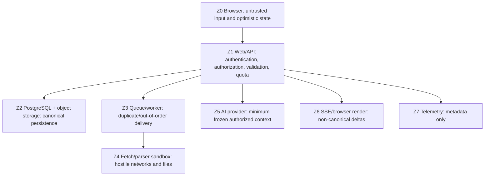

# Threat model

## Scope and security objectives

This model covers Phase 1 browser, web/API, PostgreSQL, object storage, queue/worker,
remote fetching/parsing, AI provider, SSE rendering, and telemetry. The primary
objectives are:

1. no cross-tenant data, existence metadata, stream, citation, object, job, or usage
   access;
2. no silent acknowledged canvas-data loss;
3. no network pivot through remote imports;
4. no executable behavior from user/source/model text;
5. no duplicated or unbounded paid/external work;
6. no secrets or private content in browser bundles, logs, metrics, or analytics.

Any confirmed violation of these objectives is release-blocking.

## Assets

- account identities, sessions, workspace memberships, and authorization decisions;
- board graph, source text/binaries, derived artifacts, chat/context snapshots, and
  citations;
- provider, OAuth, storage, database, and signing credentials;
- mutation receipts, queue leases, usage/quota events, and deletion state;
- service availability and spend limits.

## Trust zones

Every transition validates the receiving zone's assumptions. A queue message, signed
URL, database ID, source handle, or provider request ID is a locator, never proof of
authorization.

## Threat and control matrix

| Threat                                                             | Required controls                                                                                                                                                                                                                                                                                                                      | Required evidence before release                                                                                                                                                                        |
| ------------------------------------------------------------------ | -------------------------------------------------------------------------------------------------------------------------------------------------------------------------------------------------------------------------------------------------------------------------------------------------------------------------------------- | ------------------------------------------------------------------------------------------------------------------------------------------------------------------------------------------------------- |
| Cross-tenant ID guessing or mixed-parent IDs                       | Server resolves actor from session; active membership check; scoped repository signatures; direct `workspace_id`; composite FKs; RLS with transaction-local scope; worker reauthorization; uniform non-disclosing not-found response                                                                                                   | Two-user/two-workspace read/write/archive/restore/stream/citation/job/object matrix at API, repository, RLS, and worker layers                                                                          |
| Session theft, fixation, CSRF, or client-only protection           | Better Auth database sessions; rotation/revocation; HttpOnly/Secure/SameSite cookies; origin/CSRF checks for mutations; server checks on pages/actions/routes; no sensitive authorization decision in proxy/middleware alone                                                                                                           | Login/logout/revoke/expiry tests, forged-cookie and cross-origin mutation negatives, session-to-workspace mismatch tests                                                                                |
| Overbroad or replayed signed object access                         | Private bucket; exact workspace-derived key; exact HTTP verb, content type/length/checksum; short TTL; never sign a prefix; upload completion rechecks membership and actual object bytes/head; download authorization at request time; signed URLs excluded from logs                                                                 | Real-S3 contract negatives for wrong key, method, checksum, expiry, user, workspace, and CORS; S3Mock is not sufficient                                                                                 |
| SSRF, redirect rebinding, cloud metadata, or decompression bomb    | HTTPS only; strip credentials; resolve destination immediately before connection; block loopback/private/link-local/multicast/unspecified/metadata IPv4 and IPv6; re-resolve every redirect; restrict ports; no ambient credentials; connect/read/overall timeouts; byte/decompression/redirect limits; sandbox parser with no network | Corpus covering numeric/encoded IPs, IPv4-mapped IPv6, DNS rebinding simulation, every redirect hop, metadata hosts, excessive content length, chunked overflow, compressed bombs, slow response        |
| Malicious PDF/text/HTML, stored/reflected XSS, unsafe links        | Verify magic bytes and declared type; quarantine; bounded parser; treat extraction as plain data; escape by default; sanitized Markdown allowlist; URL scheme allowlist; `noopener noreferrer`; strict CSP; no unsanitized `dangerouslySetInnerHTML`; filenames never become markup                                                    | Stored/reflected XSS fixture suite for titles, names, HTML, Markdown, SVG/script payloads, model output and parser output; CSP report review                                                            |
| Prompt injection broadens scope or executes effects                | Imported text is delimited untrusted data; privileged instructions separate; no side-effecting tools in grounded chat; frozen authorized manifest; server-owned source handles; generated handles validated; reauthorize before finalization/exposure; no secrets in prompt                                                            | Adversarial sources requesting secrets, new sources, tools, system prompt, cross-tenant IDs, invalid citations, or navigation; all remain data and fail closed                                          |
| Autosave loss, stale overwrite, or false acknowledgement           | Dirty/saving/failed/conflict states; bounded ordered mutation batch; stable mutation ID; per-record expected revision; atomic receipt + changes; monotonic ack; no last-write-wins; local operations retained until acknowledged; unload warning                                                                                       | Dropped/delayed/duplicated/out-of-order responses, offline/reconnect, two-tab same-record conflict, unrelated-record concurrent edits, refresh after acknowledged save, fault between transaction steps |
| Duplicate ingestion, message, artifact, usage, or quota commitment | Logical operation ID and immutable attempts; database uniqueness; pg-boss transactional enqueue; idempotent worker effects; leases and stale-worker guard; canonical finalization once; append-only unique usage events; bounded retry classification                                                                                  | Crash/fault injection before/after external effect and before/after commit; duplicate/out-of-order queue delivery; manual retry lineage; usage and canonical-message uniqueness                         |
| Indeterminate paid-provider outcome                                | Persist attempt before call; provider idempotency key when available; never automatically reinvoke after ambiguous timeout/disconnect; terminal `reconciliation_required`; operator/provider reconciliation records usage separately                                                                                                   | Simulated provider success followed by connection loss, missing provider status endpoint, repeated client retry, cancellation race                                                                      |
| Queue poisoning or stale worker                                    | IDs-only job payload; schema validation; current membership/resource state rechecked; least-privilege worker role; lease token/version on commit; cancellation/newer terminal state wins; bounded concurrency/backoff/dead letter                                                                                                      | Malformed payload, foreign tenant ID, deleted parent, duplicate claim, expired lease, cancellation and terminal-write race tests                                                                        |
| Sensitive telemetry or client bundle leakage                       | Server-only secret modules; build-time bundle scan; metadata-only structured logs; error redaction; no raw content/URL/prompt/response/signed URL; access-controlled operational views; retention limits                                                                                                                               | Secret scanning, browser bundle inspection, representative error/log snapshot tests, analytics payload review                                                                                           |
| Resource exhaustion and cost abuse                                 | Central file/page/time/token/rate/workspace limits; preflight and worker enforcement; per-account/workspace/IP dimensions; bounded queue depth/concurrency/retries; cancellations; reservations reconciled with actual usage                                                                                                           | Limit boundary tests, concurrency race tests, retry-storm simulation, oversized/slow/decompression fixtures, quota failure UX                                                                           |
| Deletion/retention bypass                                          | Immediate authorization removal; tombstone prevents new context/job use; delete all DB/object/artifact/cache records by policy; queued work cancelled; backup expiry documented; idempotent deletion workflow                                                                                                                          | Deleted resource cannot be read, signed, processed, cited, or regenerated; inventory reconciliation; backup-expiry exercise                                                                             |

M5 additionally persists only normalized canvas save outcome metadata in an append-only,
forced-RLS `operational_event` table. The tenant-scoped operations view derives alert
counts and queue ages from canonical records and never returns source, prompt, response,
filename, URL, credential, or signed-link content. Security headers deny framing and
objects, constrain browser capabilities, and make the referrer policy explicit; automated
checks also reject forged mutation origins and render hostile names as inert text.

## Important abuse cases

### Autosave acknowledgement without durable state

An attacker or ordinary fault duplicates mutation IDs, reorders responses, drops the
connection after commit, or races two tabs. The client must never infer persistence from
an optimistic state. Only a matching monotonic server receipt marks operations clean;
retrying an acknowledged mutation returns the same receipt.

### Paid operation duplicated after ambiguity

The provider completes a generation but the network fails before Siftloom observes the
response. Automatic retry could create a second billable output and conflicting canonical
message. The attempt becomes `reconciliation_required`; the same provider operation is
queried/reconciled if supported, but is not automatically reinvoked.

### Public URL as a network pivot

A URL starts public, redirects or resolves to loopback/private/link-local/cloud metadata,
or returns a compressed stream far larger than advertised. Safety checks repeat after DNS
resolution and every redirect immediately before connection; fetchers have no ambient
cloud credentials and enforce decoded-byte and time ceilings.

## Security assumptions requiring deployment verification

- AWS account/roles, RDS roles, S3 block-public-access, encryption, CORS, backup and
  deletion policies match the ADRs.
- Application and worker roles do not have PostgreSQL `BYPASSRLS`; migration role is not
  used at runtime.
- ALB/proxy preserves SSE flushing and enforces sensible header/body/time limits.
- OAuth redirect URIs and mail sending domain are production-controlled.
- Parser containers/processes have no network and strict CPU/memory/temp-disk limits.
- Provider agreements and configured region/retention match product disclosures.

## Deferred risks

Multiplayer presence, public sharing, external webhooks, tools/actions, billing, team
administration, and arbitrary public-video transcript suppliers are out of Phase 1. Each
adds new trust boundaries and requires a threat-model update before implementation.
